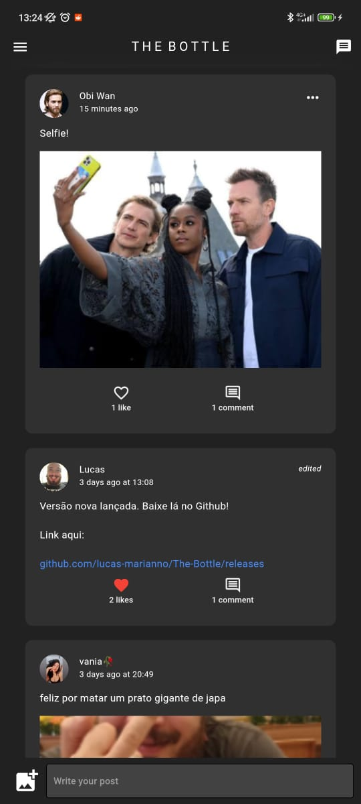
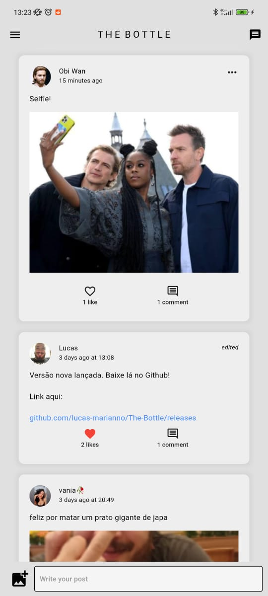
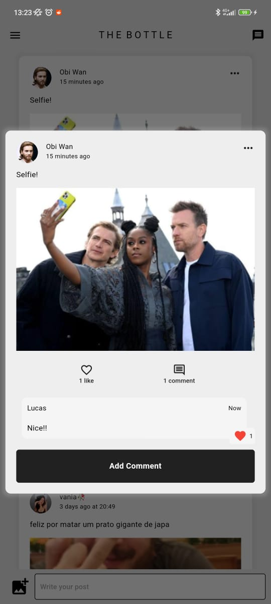
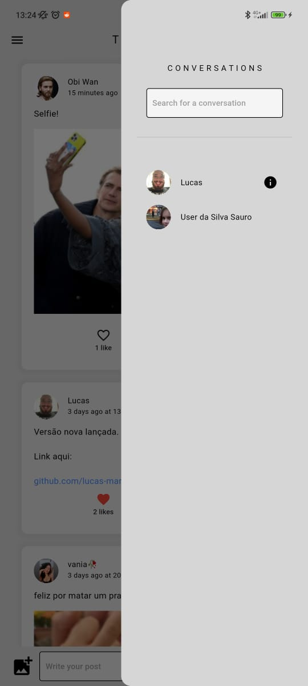
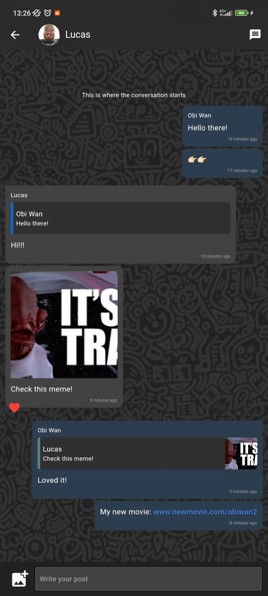
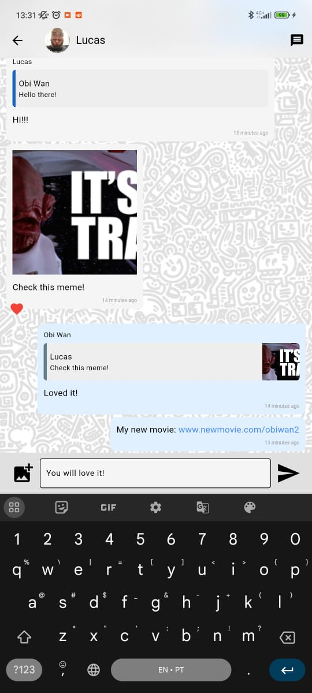
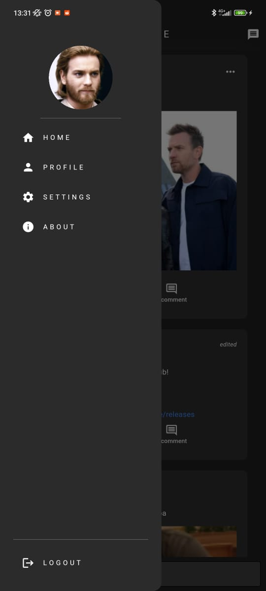
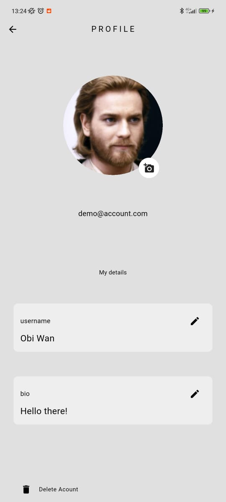

# The Bottle

Write your message, add a picture, put it in a bottle and throw it in the ocean

## About The Bottle

A Social Media App inspired by Facebook and WhatsApp.

This project was developed solely with the intention of study and learning.

Completely developed with Flutter and Firebase by [Lucas Marianno](https://linktr.ee/lucasmarianno).

## Features:

- Post text
- Post pictures
- Comment
- Like posts
- Like comments
- Edit your profile page
- Send individual messages

##
### Read the latest [Release Notes](https://github.com/lucas-marianno/The-Bottle/releases) for detailed and up to date info on features!
##
##
##

___
# App Preview

### Post feed

___
### Dark and Light Mode

___
### Comments and Likes

___
### Conversations

___
### Private messages, photos and links

___
### Like and reply to private messages

___
### Multiple pages

___
### Choose your username and biography
